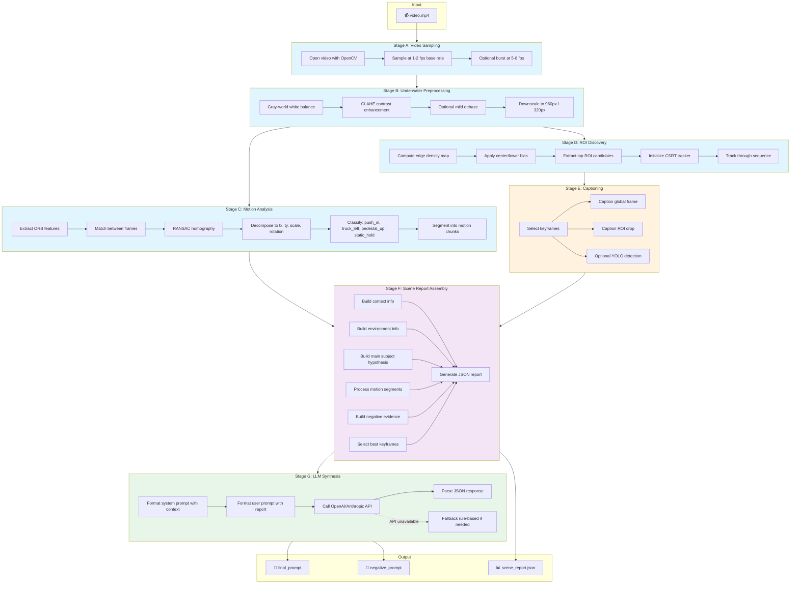
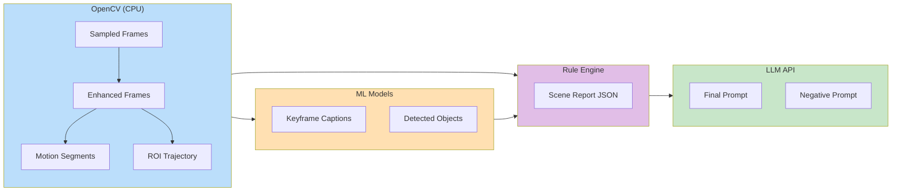
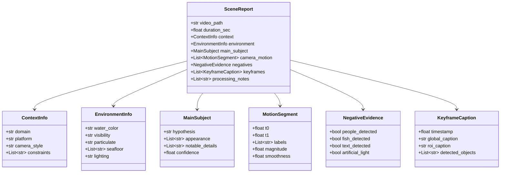
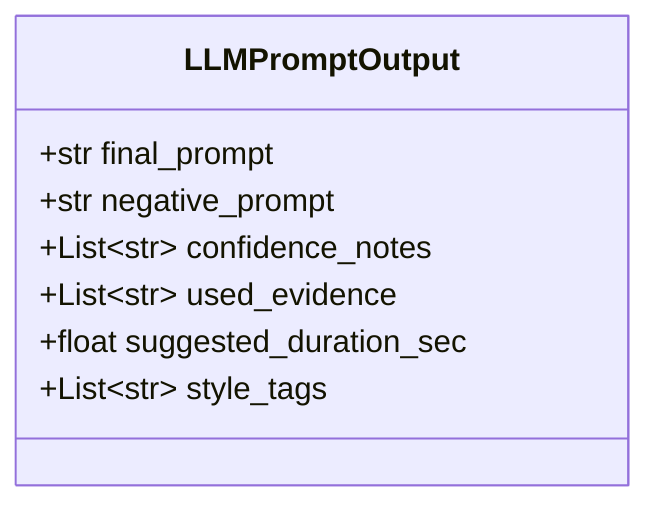

# Pipeline Flowchart

## Mermaid Diagram

```mermaid
flowchart TD
    subgraph Input
        V[📹 video.mp4]
    end

    subgraph StageA["Stage A: Video Sampling"]
        A1[Open video with OpenCV]
        A2[Sample at 1-2 fps base rate]
        A3[Optional burst at 5-8 fps]
        A1 --> A2 --> A3
    end

    subgraph StageB["Stage B: Underwater Preprocessing"]
        B1[Gray-world white balance]
        B2[CLAHE contrast enhancement]
        B3[Optional mild dehaze]
        B4[Downscale to 960px / 320px]
        B1 --> B2 --> B3 --> B4
    end

    subgraph StageC["Stage C: Motion Analysis"]
        C1[Extract ORB features]
        C2[Match between frames]
        C3[RANSAC homography]
        C4[Decompose to tx, ty, scale, rotation]
        C5[Classify: push_in, truck_left, pedestal_up, static_hold]
        C6[Segment into motion chunks]
        C1 --> C2 --> C3 --> C4 --> C5 --> C6
    end

    subgraph StageD["Stage D: ROI Discovery"]
        D1[Compute edge density map]
        D2[Apply center/lower bias]
        D3[Extract top ROI candidates]
        D4[Initialize CSRT tracker]
        D5[Track through sequence]
        D1 --> D2 --> D3 --> D4 --> D5
    end

    subgraph StageE["Stage E: Captioning"]
        E1[Select keyframes]
        E2[Caption global frame]
        E3[Caption ROI crop]
        E4[Optional YOLO detection]
        E1 --> E2
        E1 --> E3
        E1 --> E4
    end

    subgraph StageF["Stage F: Scene Report Assembly"]
        F1[Build context info]
        F2[Build environment info]
        F3[Build main subject hypothesis]
        F4[Process motion segments]
        F5[Build negative evidence]
        F6[Select best keyframes]
        F7[Generate JSON report]
        F1 --> F7
        F2 --> F7
        F3 --> F7
        F4 --> F7
        F5 --> F7
        F6 --> F7
    end

    subgraph StageG["Stage G: LLM Synthesis"]
        G1[Format system prompt with context]
        G2[Format user prompt with report]
        G3[Call OpenAI/Anthropic API]
        G4[Parse JSON response]
        G5[Fallback rule-based if needed]
        G1 --> G2 --> G3 --> G4
        G3 -.->|API unavailable| G5
    end

    subgraph Output
        O1[📄 final_prompt]
        O2[📄 negative_prompt]
        O3[📊 scene_report.json]
    end

    V --> StageA
    StageA --> StageB
    StageB --> StageC
    StageB --> StageD
    StageC --> StageF
    StageD --> StageE
    StageE --> StageF
    StageF --> StageG
    StageG --> O1
    StageG --> O2
    StageF --> O3

    style StageA fill:#e1f5fe
    style StageB fill:#e1f5fe
    style StageC fill:#e1f5fe
    style StageD fill:#e1f5fe
    style StageE fill:#fff3e0
    style StageF fill:#f3e5f5
    style StageG fill:#e8f5e9
```

## Data Flow

```mermaid
flowchart LR
    subgraph OpenCV["OpenCV (CPU)"]
        direction TB
        Frames["Sampled Frames"]
        Enhanced["Enhanced Frames"]
        Motion["Motion Segments"]
        ROIs["ROI Trajectory"]
        Frames --> Enhanced
        Enhanced --> Motion
        Enhanced --> ROIs
    end

    subgraph ML["ML Models"]
        direction TB
        Captions["Keyframe Captions"]
        Objects["Detected Objects"]
    end

    subgraph Rules["Rule Engine"]
        direction TB
        Report["Scene Report JSON"]
    end

    subgraph LLM["LLM API"]
        direction TB
        Prompt["Final Prompt"]
        Negative["Negative Prompt"]
    end

    OpenCV --> ML
    OpenCV --> Rules
    ML --> Rules
    Rules --> LLM

    style OpenCV fill:#bbdefb
    style ML fill:#ffe0b2
    style Rules fill:#e1bee7
    style LLM fill:#c8e6c9
```

## Scene Report Structure

```mermaid
classDiagram
    class SceneReport {
        +str video_path
        +float duration_sec
        +ContextInfo context
        +EnvironmentInfo environment
        +MainSubject main_subject
        +List~MotionSegment~ camera_motion
        +NegativeEvidence negatives
        +List~KeyframeCaption~ keyframes
        +List~str~ processing_notes
    }

    class ContextInfo {
        +str domain
        +str platform
        +str camera_style
        +List~str~ constraints
    }

    class EnvironmentInfo {
        +str water_color
        +str visibility
        +str particulate
        +List~str~ seafloor
        +str lighting
    }

    class MainSubject {
        +str hypothesis
        +List~str~ appearance
        +List~str~ notable_details
        +float confidence
    }

    class MotionSegment {
        +float t0
        +float t1
        +List~str~ labels
        +float magnitude
        +float smoothness
    }

    class NegativeEvidence {
        +bool people_detected
        +bool fish_detected
        +bool text_detected
        +bool artificial_light
    }

    class KeyframeCaption {
        +float timestamp
        +str global_caption
        +str roi_caption
        +List~str~ detected_objects
    }

    SceneReport --> ContextInfo
    SceneReport --> EnvironmentInfo
    SceneReport --> MainSubject
    SceneReport --> MotionSegment
    SceneReport --> NegativeEvidence
    SceneReport --> KeyframeCaption
```

## LLM Output Structure

```mermaid
classDiagram
    class LLMPromptOutput {
        +str final_prompt
        +str negative_prompt
        +List~str~ confidence_notes
        +List~str~ used_evidence
        +float suggested_duration_sec
        +List~str~ style_tags
    }
```

## Processing Timeline

```mermaid
gantt
    title Pipeline Processing (4-second video)
    dateFormat ss
    axisFormat %S

    section Stage A
    Video Sampling     :a1, 00, 2s

    section Stage B
    Preprocessing      :b1, after a1, 3s

    section Stage C
    Motion Analysis    :c1, after b1, 4s

    section Stage D
    ROI Tracking       :d1, after b1, 5s

    section Stage E
    Captioning         :e1, after d1, 15s

    section Stage F
    Report Assembly    :f1, after e1, 1s

    section Stage G
    LLM Synthesis      :g1, after f1, 3s
```
